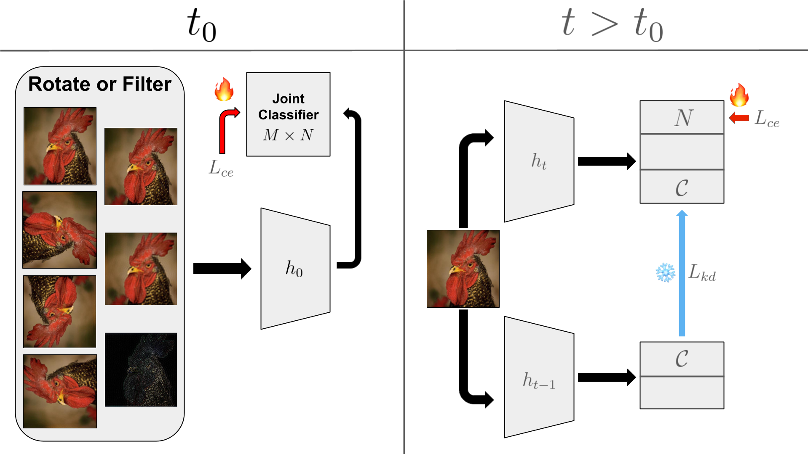

# Revisiting Self-Supervised Label Augmentation for Exemplar-Free Class-Incremental Learning (WORK IN PROGRESS)

## UPDATE:

Training logs for the rest of the random seeds for the last ablation have been added to ```cifar_training_logs```. Updated tables are below as well. The proposed method has also been compared to decoupled SSLA and evaluated on Tiny-ImageNet.

## Method
<p align="center">
  
</p>

An overview of our approach and modifications to self-supervised label augmentation. In the initial task $t_0$, an image and its labels are augmented and passed through the initial task model $h_0$ and a cross-entropy loss $L_{ce}$ is used to train $h_0$ on an $M x N$ class problem where M is the number of augmentations performed on the image (including the original image). On subsequent tasks $t > t_0$, an image is passed through the current task model $h_t$ and the previous task model $h_{t−1}$. Regularization is performed by a logit knowledge distillation loss Lkd on only the non-augmented class logits $C$ and $L_{ce}$ is used to train $h_t$ on
an $N$ class problem.

## Results

You can check our training logs for [CIFAR-100](https://github.com/arimitsu06/revisit_ssla/blob/main/cifar_training_logs) and [Tiny-ImageNet](https://github.com/arimitsu06/revisit_ssla/blob/main/tinyimagenet_training_logs)


| Method                 | Venue      | CIFAR-100 $A_{last}$ | CIFAR-100 $A_{inc}$ | Tiny-ImageNet $A_{last}$ | Tiny-ImageNet $A_{inc}$ |
|------------------------|-----------|------------------------|------------------------|---------------------------|---------------------------|
| PASS              | CVPR '21  | 37.8 ± 0.2             | 52.3 ± 0.1             | 31.2 ± 0.4                | 45.3 ± 0.7                |
| FeTrIL            | WACV '23  | 37.0 ± 0.6             | 52.1 ± 0.5             | 24.4 ± 0.6                | 38.5 ± 1.1                |
| FeCAM             | NeurIPS '23 | 33.1 ± 0.9             | 48.1 ± 0.3             | 24.9 ± 0.5                | 38.6 ± 1.3                |
| EFC               | ICLR '24  | 43.6 ± 0.7             | 58.6 ± 0.9             | 34.1 ± 0.5                | 48.0 ± 0.6                |
| ADC               | CVPR '24  | 45.4 ± 3.0             | 59.6 ± 4.1             | 32.7 ± 0.4                | 44.9 ± 1.0                |
| LDC               | ECCV '24  | 45.4 ± 2.8             | 59.5 ± 3.9             | 34.2 ± 0.7                | 46.8 ± 1.1                |
| AdaGauss         | NeurIPS '24 | <u>46.1</u> ± 0.8           | <u>60.2</u> ± 0.9           | <u>36.5</u> ± 0.9              | <u>50.6</u> ± 0.8              |
| **LDC + SSLA**       | -         | **48.6** ± 0.7         | **63.3** ± 1.5         | **39.2** ± 0.1            | **52.8** ± 0.9            |

Comparison of last and average incremental task accuracy ($A_{last}$ and $A_{inc}$)  for 10 tasks for CIFAR-100 and Tiny-ImageNet. Mean and standard deviation using 5 different random seeds are shown. Best results are **bold** and second best are <u>underlined</u>.

| SSLA          | Rot90 | Freq         | KD  | Init | Time  | $A_{last}$ | $A_{inc}$ |
|--------------|------|-------------|----|------|------|-----------|-----------|
|              |      |             |    |      | 38   | 45.4      | 59.5      |
| ✔️           | ✔️    |             |    |      | 120  | 41.2      | 60.9      |
| ✔️           | ✔️    |             | ✔️  |      | 120  | 46.2      | **64.4**  |
| ✔️           | ✔️    |             |    | ✔️    | 50   | 47.3      | 62.9      |
| ✔️           | ✔️    |             | ✔️  | ✔️    | 50   | **48.6**  | <u>63.3</u>    |
| ✔️ (D)       | ✔️    |             | ✔️  | ✔️    | 60   | 47.4      | 61.3      |
| ✔️ (D*)      | ✔️    |             | ✔️  | ✔️    | 50   | 48.0      | 62.9      |
| ✔️           |      | ✔️ (2)       | ✔️  | ✔️    | 46   | 47.3      | 62.1      |
| ✔️           |      | ✔️ (3)       | ✔️  | ✔️    | 46   | 47.8      | 62.4      |
| ✔️           |      | ✔️ (4)       | ✔️  | ✔️    | 46   | 47.4      | 62.2      |
| ✔️           | ✔️    | ✔️ (3)       | ✔️  | ✔️    | 85   | **48.6**  | 62.9      |

Ablation study on the effectiveness of proposed components, including self-supervised label augmentation (SSLA) with D and D* denoting decoupled SSLA with and without the extra task for data augmentation, 90 degree rotation augmentations (Rot90), frequency domain augmentations with radius $r$ of the binary mask in parenthesis (Freq), modifying knowledge distillation to only apply on non-augmented class logits (KD), and SSLA on only the initial task (Init). Time represents total training time in minutes. Accuracy reported as mean of 5 random seeds. Best results are **bold** and second best are <u>underlined</u>.

## Implementation for Supervised Continual Learning

The code framework is taken from [PyCIL](https://github.com/G-U-N/PyCIL) and [LDC](https://github.com/alviur/ldc).

### Dependencies
1. [torch 1.81](https://github.com/pytorch/pytorch)
2. [torchvision 0.6.0](https://github.com/pytorch/vision)
3. [tqdm](https://github.com/tqdm/tqdm)
4. [numpy](https://github.com/numpy/numpy)
5. [scipy](https://github.com/scipy/scipy)

### Datasets

We performed experiments for `CIFAR100`. When training on `CIFAR100`, this framework will automatically download it.

### Run experiments

The code for our SSLA method can be found in [models/lwf.py](https://github.com/arimitsu06/revisit_ssla/blob/main/models/lwf.py).

To use LDC with LwF, run

   ```
    python main.py --config=exps/lwf.json
   ```

To use LDC with SSLA and LwF, run

   ```
    python main.py --config=exps/ssla_lwf.json
   ```

### Configuration Options

```
ssla: [true, false],
decoupled: [true, false],
decoupled_aug: [true, false],
ssla_tasks: ["init_only", "all"],
ssla_kd: ["nonaug_only", "all"],
rot90: [true, false],
freq_filter: [true, false],
freq_filter_radius: Int
```

The configs can be modified in [exps/ssla_lwf.json](https://github.com/arimitsu06/revisit_ssla/blob/main/exps/ssla_lwf.json).